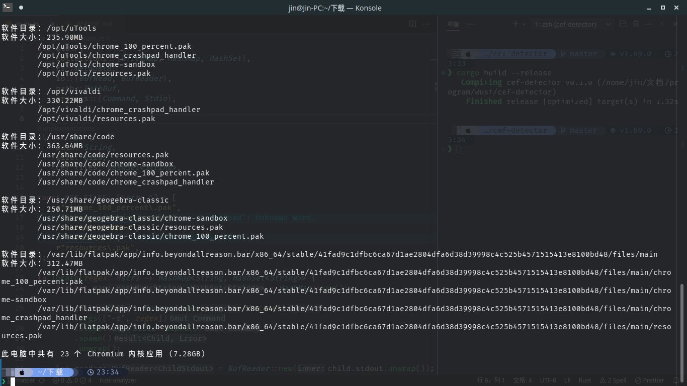

# CEF Detector for Linux

> 给 Linux 用户一点小小的 Chromium 震撼

使用 `locate` 命令查找文件，`du` 命令计算文件夹大小

运行截图：

创意来自 [@ShirasawaSama](https://github.com/ShirasawaSama) 的 [CEF Detector X](https://github.com/ShirasawaSama/CefDetectorX)
